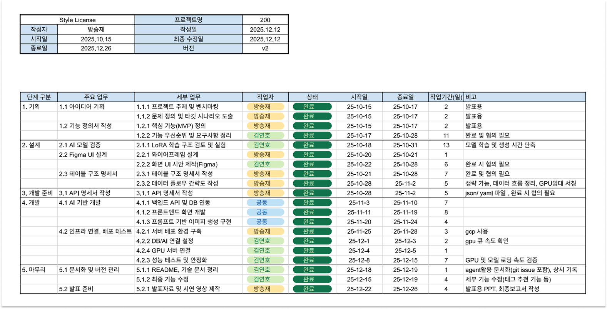

<div align="center">


# Style License

**AI 기반 아트 스타일 라이선싱 & 크리에이티브 플랫폼**

[](LICENSE)
[](https://www.python.org/)
[](https://vuejs.org/)
[](https://www.djangoproject.com/)
[](https://www.postgresql.org/)

[주요 기능](#-주요-기능) • [기술 스택](#%EF%B8%8F-기술-스택) • [시작하기](#-시작하기) • [문서](#-문서) • [아키텍처](#%EF%B8%8F-아키텍처)

</div>

---

## 📖 개요

**Style License**는 디지털 아티스트들이 AI 기반 라이선싱을 통해 자신만의 아트 스타일을 수익화할 수 있는 혁신적인 플랫폼입니다. 아티스트는 자신의 작품으로 커스텀 AI 모델을 학습시킬 수 있으며, 사용자는 저작권 보호가 보장된 라이선스 스타일로 새로운 이미지를 생성할 수 있습니다.

### 🎯 핵심 가치

- **🎨 아티스트 권리 보호**: 예술적 스타일에 대한 명확한 저작권 보호
- **🤝 투명한 라이선싱**: 합법적이고 윤리적인 AI 아트 스타일 수익화
- **✨ 상업적 이용**: 라이선스된 스타일로 생성한 AI 아트워크의 상업적 사용 가능
- **🔒 저작권 보장**: 생성된 모든 이미지에 아티스트 서명 자동 삽입

---

## 🛠️ 기술 스택

### Frontend


### Backend


### AI/ML


### Infrastructure


---

## 🏗️ 아키텍처

### 📊 WBS (Work Breakdown Structure)

<div align="center">

</div>

<br>

### 🔧 시스템 아키텍처

<div align="center">

</div>

<br>

### 아키텍처 다이어그램

```
┌──────────┐  HTTPS (CDN)  ┌─────────────────┐
│          ├───────────────┤  Cloud Storage  │
│   User   │               │(Frontend + Assets)│
│          │  HTTPS (API)  └─────────────────┘
└──────────┘      │
                  ↓
            ┌───────────┐
            │ Cloud Run │
            │ (Backend) │
            └───────────┘
    ┌───────────┴───────────┐
    │                         │
    ↓                         ↓
┌───────────┐           ┌───────────┐
│ Cloud SQL │           │ RabbitMQ  │
│(PostgreSQL)│          (on GCE VM)│
└───────────┘           └───────────┘
                              │
                 ┌────────────┴────────────┐
                 │                         │
                 ↓                         ↓
         ┌───────────────┐       ┌───────────────┐
         │ Training Server │       │Inference Server │
         │  (GCE + GPU)  │       │  (GCE + GPU)  │
         └───────────────┘       └───────────────┘
```

### 컴포넌트 개요

| 컴포넌트 | 기술 | 호스팅 (GCP) | 목적 |
| -------------------- | -------------- | ------------------------ | ---------------------------------------- |
| **Frontend** | Vue 3 + Vite | **Cloud Storage + CDN** | Instagram 스타일의 UI를 가진 SPA |
| **Backend** | Django + DRF | **Cloud Run** | REST API, 인증, 비즈니스 로직 |
| **Database** | PostgreSQL 15 | **Cloud SQL** | 사용자 데이터, 모델, 트랜잭션 |
| **Message Queue** | RabbitMQ | **Compute Engine (GCE)** | 비동기 작업 분산 |
| **Training Server** | PyTorch + LoRA | **Compute Engine (GCE)** | Stable Diffusion 모델 파인튜닝 |
| **Inference Server** | Diffusers | **Compute Engine (GCE)** | 학습된 모델로 이미지 생성 |
| **Storage** | - | **Cloud Storage** | 모델, 이미지, 서명 저장 |

---

## ✨ 주요 기능

### 아티스트를 위한 기능

- **🖼️ 스타일 모델 생성**: 10-100개의 학습 이미지를 업로드하여 AI 모델 생성
- **💰 유연한 가격 책정**: 생성된 이미지당 커스텀 토큰 가격 설정
- **📊 학습 진행 상황**: 실시간 LoRA 파인튜닝 진행 상황 추적
- **✍️ 서명 보호**: 생성된 모든 이미지에 워터마크 자동 삽입
- **💵 수익 분배**: 모든 이미지 생성에서 토큰 수익 획득

### 사용자를 위한 기능

- **🎭 스타일 갤러리 탐색**: 다양한 아티스트의 독특한 아트 스타일 발견
- **⚡ 즉시 생성**: 라이선스된 스타일로 몇 초 안에 이미지 생성
- **🎛️ 커스터마이징 옵션**: 다양한 화면 비율 (1:1, 16:9, 9:16, 4:3, 3:4)
- **🔖 태그 기반 프롬프트**: 영문 키워드 기반 프롬프트 시스템
- **📱 커뮤니티 피드**: 생성된 아트워크 공유 및 발견

### 플랫폼 기능

- **🪙 토큰 경제**: 안전한 토큰 기반 결제 시스템
- **🔐 Google OAuth**: Google 계정으로 간편한 인증
- **🔔 알림**: 학습, 생성, 소셜 인터랙션에 대한 실시간 업데이트
- **💬 소셜 기능**: 좋아요, 댓글, 다른 크리에이터 팔로우
- **🔍 고급 검색**: 태그, 아티스트, 인기도로 스타일 검색

---

## 🖥️ 화면 구성 및 시연 동영상

- **시연 영상** 👉 [**YouTube 바로가기**](https://www.youtube.com/shorts/Ofq0wxisI70)
  <br>

<table>
  <tr>
    <th align="center">메인 페이지</th>
    <th align="center">이미지 상세보기 페이지</th>
    <th align="center">이미지 생성하기 페이지</th>
    <th align="center">마이 페이지</th>
  </tr>
  <tr>
    <td align="center"></td>
    <td align="center"></td>
    <td align="center"></td>
    <td align="center"></td>
  </tr>
  <tr>
    <th align="center">스타일 검색 페이지</th>
    <th align="center">스타일 생성 페이지</th>
    <th align="center">알림 페이지</th>
    <th align="center">결제 페이지</th>
  </tr>
  <tr>
    <td align="center"></td>
    <td align="center"></td>
    <td align="center"></td>
    <td align="center"></td>
  </tr>
</table>

<br>

---

## 🚀 시작하기

### 사전 요구사항

- **Docker** & **Docker Compose** (권장)
- **Node.js** 18+ 및 npm (프론트엔드용)
- **Python** 3.11+ (백엔드/AI 서버용)
- **PostgreSQL** 15+ (Docker 없이 실행 시)
- **CUDA** 11.8+ (GPU 가속 학습/추론용)

### Docker로 빠른 시작

```bash
# 1. 저장소 클론
git clone https://github.com/your-org/stylelicense.git
cd stylelicense

# 2. 환경 변수 설정
cp .env.example .env
# .env 파일을 구성에 맞게 편집

# 3. 모든 서비스 시작
docker-compose up -d

# 4. 데이터베이스 초기화
docker-compose exec backend python manage.py migrate
docker-compose exec backend python manage.py createsuperuser

# 5. 애플리케이션 접속
# Frontend: http://localhost:5173
# Backend API: http://localhost:8000
# RabbitMQ Management: http://localhost:15672
```

### 개발 환경 설정

<details>
<summary><b>프론트엔드 설정</b></summary>

```bash
cd apps/frontend

# 의존성 설치
npm install

# 환경 변수 설정
cp .env.example .env

# 개발 서버 시작
npm run dev
```

</details>

<details>
<summary><b>백엔드 설정</b></summary>

```bash
cd apps/backend

# 가상환경 생성
python -m venv venv
source venv/bin/activate  # On Windows: venv\Scripts\activate

# 의존성 설치
pip install -r requirements.txt

# 마이그레이션 실행
python manage.py migrate

# 개발 서버 시작
python manage.py runserver
```

</details>

<details>
<summary><b>AI 서버 설정</b></summary>

```bash
# Training Server
cd apps/training-server
pip install -r requirements.txt
python rabbitmq_consumer.py

# Inference Server
cd apps/inference-server
pip install -r requirements.txt
python rabbitmq_consumer.py
```

</details>

---

## 📂 프로젝트 구조

```
StyleLicense/
├── apps/
│   ├── backend/              # Django REST API
│   ├── frontend/             # Vue 3 SPA
│   ├── training-server/      # LoRA 파인튜닝
│   └── inference-server/     # 이미지 생성
│
├── docs/
│   ├── design/pages/         # UI 디자인 목업 (17개 화면)
│   ├── database/             # 데이터베이스 스키마
│   ├── API.md                # API 문서
│   └── PATTERNS.md           # 코드 패턴
│
├── docker-compose.yml        # 개발 환경
├── TECHSPEC.md               # 기술 명세
├── PLAN.md                   # 개발 로드맵
└── README.md                 # 이 파일
```

---

## 📚 문서

| 문서                                                | 설명                           |
| --------------------------------------------------- | ------------------------------ |
| [TECHSPEC.md](TECHSPEC.md)                          | 전체 기술 명세                 |
| [PLAN.md](PLAN.md)                                  | 개발 마일스톤 및 진행 상황     |
| [API.md](docs/API.md)                               | REST API 엔드포인트 및 스키마  |
| [Database Schema](docs/database/README.md)          | PostgreSQL 스키마 및 관계      |
| [Frontend Guide](apps/frontend/README.md)           | Vue 3 아키텍처 및 디자인 시스템 |
| [Backend Guide](apps/backend/README.md)             | Django REST Framework 패턴     |
| [Training Server](apps/training-server/README.md)   | LoRA 파인튜닝 파이프라인       |
| [Inference Server](apps/inference-server/README.md) | 이미지 생성 파이프라인         |
| [Docker Guide](DOCKER.md)                           | 배포 및 컨테이너 설정          |

---

## 🎨 스크린샷

<details>
<summary><b>UI 목업 보기</b></summary>

플랫폼은 Instagram에서 영감을 받은 17개의 정교하게 제작된 화면을 제공합니다:

- **인증**: Google OAuth 로그인
- **메인 피드**: 무한 스크롤이 있는 공개 갤러리
- **스타일 마켓플레이스**: 아트 스타일 탐색 및 검색
- **스타일 상세**: 샘플 갤러리 및 생성 인터페이스
- **프로필 페이지**: 아티스트 포트폴리오 및 사용자 프로필
- **생성 플로우**: 다단계 스타일 모델 생성
- **알림**: 실시간 업데이트
- **커뮤니티**: 댓글, 좋아요, 팔로우

> 📁 모든 목업 보기: [docs/design/pages/](docs/design/pages/)

</details>

---

## 🔒 보안

- **세션 기반 인증**: Google OAuth를 사용한 안전한 쿠키 기반 세션
- **CSRF 보호**: Django CSRF 미들웨어 활성화
- **SQL 인젝션 방지**: Django ORM 파라미터화된 쿼리
- **XSS 보호**: Vue 3 자동 이스케이핑 + CSP 헤더
- **HTTPS Only**: 프로덕션에서 SSL/TLS 암호화
- **속도 제한**: API 엔드포인트용 토큰 버킷 알고리즘
- **서명 보호**: 생성된 이미지에 불변 워터마크

---

## 🧪 테스트

```bash
# Frontend 테스트
cd apps/frontend
npm run test           # 단위 테스트 (Vitest)
npm run test:e2e       # E2E 테스트 (Playwright)

# Backend 테스트
cd apps/backend
python manage.py test  # Django 테스트
pytest                 # 단위 테스트

# 코드 품질
npm run lint           # Frontend 린팅
pylint app/            # Backend 린팅
```

---

## 🤝 기여하기

기여를 환영합니다! 다음 단계를 따라주세요:

1. 저장소 Fork
2. 기능 브랜치 생성 (`git checkout -b feature/amazing-feature`)
3. 앱 디렉토리의 관련 CODE_GUIDE.md 읽기
4. 디자인 시스템 가이드라인 준수 ([Frontend README](apps/frontend/README.md#design-system) 참조)
5. 변경사항 커밋 (`git commit -m 'feat: add amazing feature'`)
6. 브랜치에 Push (`git push origin feature/amazing-feature`)
7. Pull Request 생성

**개발 가이드라인**:

- 기능 요구사항은 [TECHSPEC.md](TECHSPEC.md) 참조
- 현재 마일스톤은 [PLAN.md](PLAN.md) 확인
- 코드 패턴은 [CODE_GUIDE.md](apps/*/CODE_GUIDE.md) 사용
- [docs/design/pages/](docs/design/pages/)의 디자인 목업과 일치

---

## 📊 프로젝트 상태

**현재 버전**: MVP 개발 (M1 Foundation)

**진행 상황**:

- ✅ 프로젝트 설정 및 아키텍처 디자인
- ✅ 데이터베이스 스키마 및 모델
- ✅ Docker 인프라
- 🚧 인증 시스템 (진행 중)
- ⏳ 핵심 백엔드 API (계획됨)
- ⏳ 프론트엔드 UI 구현 (계획됨)
- ⏳ AI 학습/추론 파이프라인 (계획됨)

자세한 마일스톤 및 작업 추적은 [PLAN.md](PLAN.md)를 참조하세요.

---

## 📄 라이선스

이 프로젝트는 MIT 라이선스에 따라 라이선스가 부여됩니다 - 자세한 내용은 [LICENSE](LICENSE) 파일을 참조하세요.

---

## 👥 팀

**SSAFY 12기 - 자율 프로젝트**

- **프로젝트 기간**: 2025-01 ~ 2025-02
- **팀 규모**: [팀 규모]
- **소속**: 삼성 청년 SW 아카데미

---

## 🙏 감사의 글

- [Stable Diffusion](https://github.com/CompVis/stable-diffusion) - 기본 AI 모델
- [LoRA](https://github.com/microsoft/LoRA) - 파라미터 효율적 파인튜닝
- [Hugging Face Diffusers](https://github.com/huggingface/diffusers) - 확산 모델 라이브러리
- Instagram - UI/UX 디자인 영감

---

<div align="center">

**Style License Team이 ❤️를 담아 제작했습니다**

[버그 제보](https://github.com/your-org/stylelicense/issues) • [기능 요청](https://github.com/your-org/stylelicense/issues) • [문서](TECHSPEC.md)

</div>
