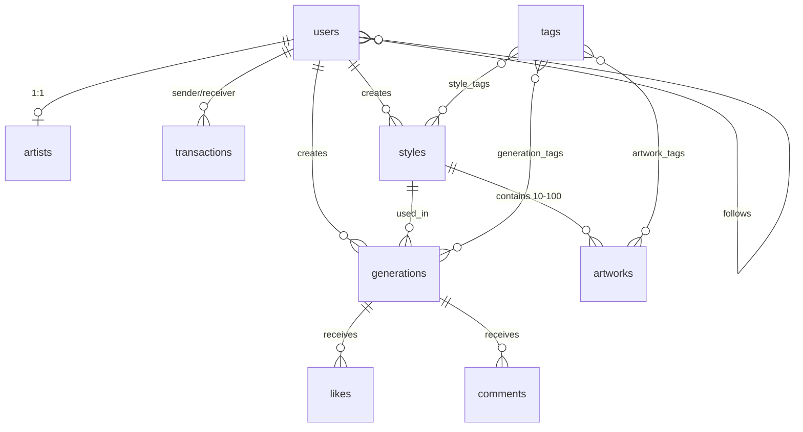

# Database Documentation

**Project**: Style License  
**DBMS**: PostgreSQL 15.x  
**Version**: 2.0 (Hybrid Structure)  
**Last Updated**: 2025-10-28

---

## 📚 문서 구조

이 문서는 4개의 핵심 파일로 구성되어 있습니다:

| 문서 | 용도 | 언제 사용? |
|------|------|----------|
| **README.md** (현재) | 전체 개요, ERD, 빠른 참조 | 처음 시작할 때, 전체 구조 파악 |
| **[TABLES.md](TABLES.md)** | 모든 테이블 정의 (CREATE TABLE) | 스키마 확인, 컬럼/제약조건 상세 |
| **[QUERIES.md](guides/QUERIES.md)** | 실전 쿼리 패턴 + Django ORM | 코드 작성 시, 예제 필요할 때 |
| **[OPERATIONS.md](guides/OPERATIONS.md)** | 마이그레이션 + 운영 가이드 | 배포, 성능 최적화, 백업 |

---

## 목차
1. [DB 개요](#1-db-개요)
2. [스키마 구조](#2-스키마-구조)
3. [ERD (관계도)](#3-erd-관계도)
4. [설계 원칙](#4-설계-원칙)
5. [빠른 참조](#5-빠른-참조)

---

## 1. DB 개요

### 기본 정보
- **DBMS**: PostgreSQL 15.x
- **문자셋**: UTF-8
- **타임존**: UTC
- **총 테이블**: 13개 (7개 스키마)

### 데이터 타입 규칙
| 용도 | 타입 | 예시 |
|------|------|------|
| ID | BIGSERIAL | `id BIGSERIAL PRIMARY KEY` |
| 토큰/수량 | BIGINT | `token_balance BIGINT DEFAULT 0` |
| 금액 | DECIMAL(10,2) | `price_per_token DECIMAL(10,2)` |
| 텍스트 | TEXT / VARCHAR(n) | `description TEXT` |
| 날짜 | TIMESTAMPTZ | `created_at TIMESTAMPTZ` |
| 불린 | BOOLEAN | `is_active BOOLEAN DEFAULT TRUE` |
| JSON | JSONB | `metadata JSONB` |

### 네이밍 규칙
- **테이블**: 소문자 snake_case 복수형 (`users`, `transactions`)
- **컬럼**: 소문자 snake_case (`user_id`, `created_at`)
- **외래키**: `{테이블명}_id` (`style_id`, `generation_id`)
- **불린**: `is_` 접두사 (`is_active`, `is_public`)
- **인덱스**: `idx_{table}_{column(s)}` (`idx_users_provider_userid`)

---

## 2. 스키마 구조

### 논리적 분류

```
style_license_db (13 tables)
│
├── 1️⃣ auth (인증 및 사용자)
│   ├── users (2)                    # OAuth 사용자 계정
│   └── artists (2)                  # 작가 프로필
│
├── 2️⃣ token (토큰 및 결제)
│   ├── transactions (2)             # 모든 토큰 거래
│   └── purchases (2)                # 토스 결제 기록
│
├── 3️⃣ style (화풍 및 학습)
│   ├── styles (2)                   # AI 화풍 모델
│   └── artworks (2)                 # 학습용 이미지
│
├── 4️⃣ generation (이미지 생성)
│   └── generations (1)              # 생성 요청/결과
│
├── 5️⃣ community (소셜 기능)
│   ├── follows (3)                  # 팔로우 관계
│   ├── likes (3)                    # 좋아요
│   └── comments (3)                 # 댓글/대댓글
│
├── 6️⃣ tagging (태그 시스템)
│   ├── tags (4)                     # 태그 마스터
│   ├── style_tags (4)               # 스타일-태그 M:N
│   ├── artwork_tags (4)             # 학습이미지-태그 M:N
│   └── generation_tags (4)          # 생성물-태그 M:N
│
└── 7️⃣ system (시스템)
    └── notifications (1)            # 사용자 알림
```

### 스키마별 역할

| 스키마 | 주요 기능 | 핵심 테이블 |
|--------|----------|-----------|
| **auth** | Google OAuth 인증, 작가 권한 | users, artists |
| **token** | 토큰 구매/송금, 토스 결제 | transactions, purchases |
| **style** | 화풍 학습, 이미지 관리 | styles, artworks |
| **generation** | 이미지 생성 요청/결과 | generations |
| **community** | 팔로우, 좋아요, 댓글 | follows, likes, comments |
| **tagging** | 영어 태그 검색/분류 | tags, *_tags |
| **system** | 알림 시스템 | notifications |

---

## 3. ERD (관계도)

### 핵심 관계



### 주요 관계 요약

| 관계 | 카디널리티 | 설명 |
|------|-----------|------|
| users ↔ artists | 1:1 | 사용자 → 작가 권한 획득 시 생성 |
| users → styles | 1:N | 작가당 여러 화풍 (MVP: 1개 제한) |
| styles → artworks | 1:N | 화풍당 학습 이미지 10~100장 |
| styles → generations | 1:N | 한 화풍으로 여러 생성물 |
| users ↔ users | N:N | 팔로우 관계 (follows 테이블) |
| generations ← likes | 1:N | 생성물당 여러 좋아요 |
| generations ← comments | 1:N | 생성물당 여러 댓글 |

---

## 4. 설계 원칙

### 정규화
- **제3정규형(3NF)** 준수
- 반정규화: 캐싱 컬럼만 (`like_count`, `comment_count`, `follower_count`)

### 참조 무결성 (Foreign Key)

| ON DELETE 정책 | 사용 상황 |
|---------------|----------|
| **CASCADE** | 부모 삭제 시 자식도 삭제 (users → transactions) |
| **RESTRICT** | 자식이 있으면 부모 삭제 불가 (styles ← generations) |
| **SET NULL** | 부모 삭제 시 자식은 NULL (styles → transactions) |

### 도메인 무결성 (CHECK)
- 토큰 잔액 음수 방지: `CHECK (token_balance >= 0)`
- 상태값 ENUM: `CHECK (status IN ('pending','completed','failed'))`
- 자기 참조 방지: `CHECK (follower_id != following_id)`

### 소프트 삭제
- `is_active`: 관리자 비활성화
- `is_flagged`: 검열/신고된 콘텐츠
- 물리 삭제 최소화 (이력 보존)

### 감사 추적 (Audit)
- 모든 테이블: `created_at TIMESTAMPTZ`
- 변경 가능 테이블: `updated_at TIMESTAMPTZ` (트리거 자동)

### 진행 상황 추적 

- **실시간 진행률**: JSONB 컬럼으로 유연한 진행 상황 저장
- **업데이트 주기**: 
  - Training Server: 30초마다 또는 완료 시
  - Inference Server: 주요 단계마다 또는 완료 시
- **폴링 방식**: 프론트엔드가 5초마다 API 호출 (최대 30초 지연)
- **MVP 규모**: GPU 1대 환경에서 DB 부하 무시 가능 수준 (~2회/분)

---

## 5. 빠른 참조

### 핵심 테이블 한눈에 보기

#### users (사용자)
```sql
-- 핵심 컬럼
id, username, provider, provider_user_id, token_balance, role
-- 용도: OAuth 인증, 토큰 잔액 관리
-- 관계: artists(1:1), styles(1:N), generations(1:N)
```

#### transactions (거래)
```sql
-- 핵심 컬럼
sender_id, receiver_id, amount, status, related_style_id
-- 용도: 모든 토큰 거래 기록 (구매, 송금, 생성 결제)
-- 주의: SELECT FOR UPDATE 필수 (동시성)
```

#### styles (화풍)
```sql
-- 핵심 컬럼
artist_id, name, training_status, generation_cost_tokens, model_path
-- 용도: 작가의 학습된 AI 화풍 모델
-- 제약: ON DELETE RESTRICT (사용 중 삭제 불가)
```

#### generations (생성물)
```sql
-- 핵심 컬럼
user_id, style_id, status, result_url, is_public, like_count
-- 용도: 이미지 생성 요청 및 결과
-- 관계: likes(1:N), comments(1:N)
```

### 자주 사용하는 조회 패턴

```sql
-- 사용자 토큰 잔액
SELECT token_balance FROM users WHERE id = ?;

-- 공개 생성물 피드 (최신순)
SELECT * FROM generations 
WHERE is_public = true AND status = 'completed'
ORDER BY created_at DESC LIMIT 20;

-- 스타일 생성 통계
SELECT COUNT(*) FROM generations 
WHERE style_id = ? AND status = 'completed';

-- 팔로우한 작가 목록
SELECT u.* FROM users u
INNER JOIN follows f ON u.id = f.following_id
WHERE f.follower_id = ?;

-- 학습 진행 상황 확인
SELECT 
    training_status, 
    training_progress 
FROM styles 
WHERE id = ?;

-- 생성 진행 상황 확인
SELECT 
    status, 
    generation_progress 
FROM generations 
WHERE id = ?;
```

### 트랜잭션 필수 작업

```python
# 토큰 차감 (원자적 작업)
with transaction.atomic():
    user = User.objects.select_for_update().get(id=user_id)
    if user.token_balance < cost:
        raise InsufficientTokens
    user.token_balance -= cost
    user.save()
    
    Transaction.objects.create(
        sender_id=user_id,
        receiver_id=artist_id,
        amount=cost,
        status='completed'
    )
```

### 인덱스 전략

| 쿼리 패턴 | 인덱스 타입 | 예시 |
|----------|-----------|------|
| 단일 컬럼 필터 | 단일 인덱스 | `idx_styles_training_status` |
| 정렬 + 필터 | 복합 인덱스 | `idx_generations_user_created (user_id, created_at DESC)` |
| 조건부 조회 | Partial Index | `idx_generations_public WHERE is_public = true` |
| 외래키 조인 | FK 인덱스 | `idx_transactions_sender` |

---

## 다음 단계

### 테이블 상세 확인이 필요하다면
👉 **[TABLES.md](TABLES.md)** - 모든 테이블의 CREATE TABLE 문, 컬럼 상세, 제약조건

### 실제 코드 작성이 필요하다면
👉 **[QUERIES.md](guides/QUERIES.md)** - 실전 쿼리 패턴, Django ORM 예제, 트랜잭션 처리

### 배포/운영 작업이 필요하다면
👉 **[OPERATIONS.md](guides/OPERATIONS.md)** - 마이그레이션, 성능 최적화, 백업/복구, 모니터링

---

## 주요 워크플로우

### 1. 사용자 가입/로그인
```
Google OAuth → users 생성 → 웰컴 토큰 지급 (transactions)
```

### 2. 작가 등록
```
users → artists 생성 → role='artist' 업데이트
```

### 3. 스타일 학습
```
styles 생성 → artworks 업로드 (10-100장) → 검증 → 학습 큐 전송
→ Training Server → [NEW] 30초마다 진행 상황 업데이트 → model_path 저장 
→ training_status='completed'
```

### 4. 이미지 생성
```
토큰 차감 (users.token_balance) → generations 생성 (status='queued')
→ Inference Server → [NEW] 진행 상황 업데이트 → 이미지 생성 → S3 업로드 
→ result_url 저장 → 작가 수익 증가 (artists.earned_token_balance) → 알림 전송
```

### 5. 토큰 구매
```
토스 결제 → purchases 생성 → 웹훅 수신 → users.token_balance 증가
→ transactions 기록
```

---

**문서 버전**: 2.0 (Hybrid Structure)  
**작성일**: 2025-10-28  
**다음 업데이트**: [TABLES.md](TABLES.md) 참조